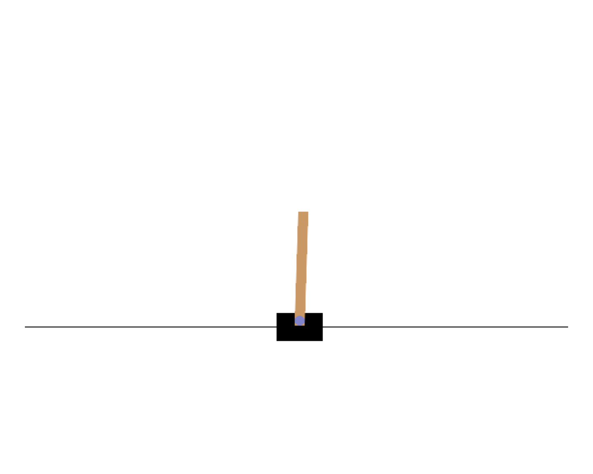

# A Comparative Study of Q-Learning and Policy Gradient Algorithms in Reinforcement Learning Applied to an Inverted Pendulum

## Overview

This repository contains the implementation of Q-Learning and Policy Gradient (REINFORCE) algorithms to solve the Cart-Pole problem using the OpenAI Gym environment.

